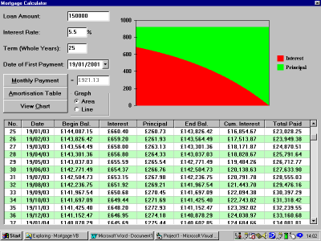



## GraphAmort

### Description

This mini-prog (which will have hopefully uploaded correctly this time!) will calculate the monthly payment required for a mortgage-style loan. Upon request, it will produce an amortisation schedule on a MSFlexGrid control. You may also view 2 simple MSCharts based on the grid's data.
 
### More Info
 

             |
---                |---
**Submitted On**   |2001-01-19 14:07:08
**By**             |[Eoin Armstrong](https://github.com/Planet-Source-Code/PSCIndex/blob/master/ByAuthor/eoin-armstrong.md)
**Level**          |Beginner
**User Rating**    |4.9 (39 globes from 8 users)
**Compatibility**  |VB 6\.0
**Category**       |[Math/ Dates](https://github.com/Planet-Source-Code/PSCIndex/blob/master/ByCategory/math-dates__1-37.md)
**World**          |[Visual Basic](https://github.com/Planet-Source-Code/PSCIndex/blob/master/ByWorld/visual-basic.md)
**Archive File**   |[CODE\_UPLOAD140791232001\.zip](https://github.com/Planet-Source-Code/eoin-armstrong-graphamort__1-14642/archive/master.zip)

